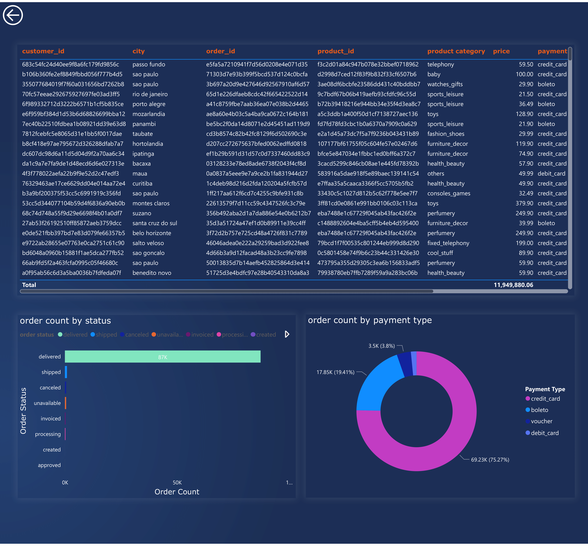
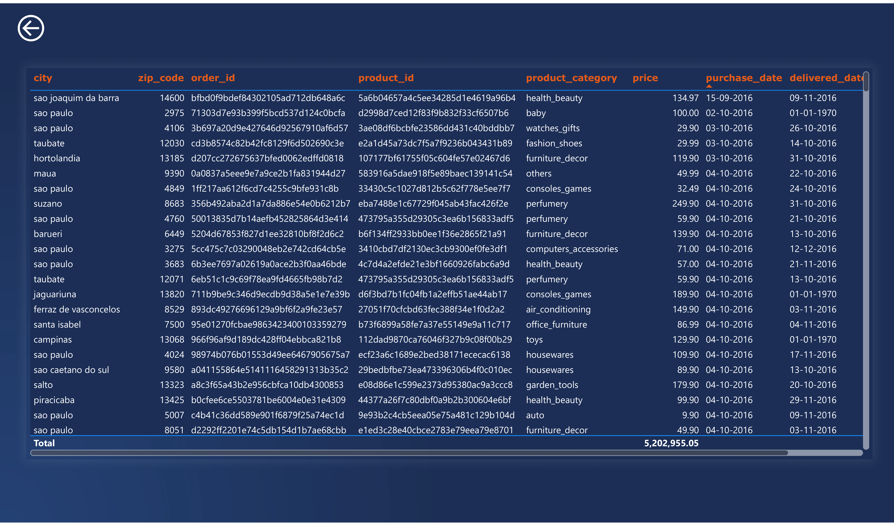

# End-to-End Data Engineering Project with GCP Big Data Technologies

Access my project files here - [Brazilian-Ecommerce-DE-Project](https://github.com/Nitin0909/Brazilian-Ecommerce-DE-Project)

## Introduction

This project demonstrates how we can leverage the Google Cloud Platform to create an ETL (Extract, Transform, Load) pipeline using big data technologies. I'am using a dataset from Brazilian e-commerce, available on Kaggle, to illustrate this process. The dataset contains various categories, including customer data, geolocation details, order information, payment records, seller profiles, and product listings. Through data processing and modeling, I aim to reveal insights like sales trends, top-performing states and cities, popular product categories, leading sellers, average order values, and the typical delivery times, among other valuable information.

## Dataset
 

This project relies on the Brazilian E-commerce dataset, which contains a wealth of information about online shopping in Brazil. You can access the dataset through this link:

Dataset - [Brazilian-Ecommerce-Dataset](https://github.com/Nitin0909/Brazilian-Ecommerce-DE-Project/tree/master/Dataset)

For a deeper understanding of the dataset's structure and field descriptions, refer to the following resources:

1. Website - [Kaggle](https://www.kaggle.com/datasets/olistbr/brazilian-ecommerce/data)

## Architecture

## Technology Used

**Programming Languages:**
- Python
- PySpark
- SQL

**Data Visualization:**
- Power BI

**Google Cloud Platform:**
- Google Cloud Storage
- Google Cloud MySQL
- Google Cloud Composer
- Google Cloud Dataproc
- Google Cloud BigQuery
- Google Cloud VPC Network

## Project Steps

  
## Step 1: Data Acquisition

I began by acquiring the Brazilian e-commerce dataset from Kaggle. You can easily obtain the dataset by following the provided download link or by visiting the Kaggle website directly. This initial step is crucial as it ensures that I have the essential dataset needed to kickstart the ETL pipeline.
  

## Step 2: Data Modeling

In this step, I applied data modeling concepts by identifying fact and dimension tables and establishing relationships between them. Fact tables contain essential numerical data, while dimension tables provide descriptive attributes to provide context for the factual data. Understanding these concepts is vital for designing an effective data model that facilitates efficient analysis and reporting.

  

## Step 3: Setting Up MySQL Database on GCP

In this step, I used a Python REST API script to create a MySQL instance on Google Cloud Platform (GCP). The process involved:

1.  Setting up a service account with the necessary permissions.
2.  Saving a JSON key on my local machine for script usage.
3.  Utilizing the `googleapiclient` and `google-auth` libraries.

The management of the database and tables is facilitated using the `pymysql` library. It is important to add my local machine's public IP address to the MySQL instance's network configuration on GCP.

**Note:** Before proceeding, ensure that you have enabled the SQL Admin API and Compute Engine API.

## Step 4: Ingesting Data into MySQL

After I set up the database and tables, the next step is to ingest data from an Excel file stored in Google Cloud Storage (GCS). This process involves the use of several libraries, including:

-   `pandas` for data manipulation.
-   `pymysql` for database interaction.
-   `openpyxl` for working with Excel files.
-   `googleapiclient` and `google-auth` for managing GCS resources.

It's crucial to ensure that my service account has the necessary permissions to read files from GCS and write data to MySQL tables.

  

## Step 5: Setting Up GCP Composer (Airflow)

In this step, I automate all ETL scripts using GCP Composer, which is a Google Cloud Platform service based on Apache Airflow.

For provisioning the Composer environment, I employed a Python REST API script and utilized the `googleapiclient` and `google-auth` libraries. The configuration parameters for Composer provisioning can be specified using the [Composer Configuration Documentation](https://cloud.google.com/composer/docs/how-to/managing/creating#api_7).

**Note:** Ensure that you've enabled the Cloud Composer API and created a service account with the necessary privileges for provisioning a new Composer environment.

  

## Step 6: Simulating New Data for Customers and Orders Tables

In this step, I enhance the realism of the ETL project by implementing two Directed Acyclic Graphs (DAGs) within GCP Composer. These DAGs are scheduled to run daily and are responsible for inserting new records into the customer, order, order_items, and order_payments tables.

To achieve this dynamic data addition, I leverage the 'faker' library for generating simulated data and use 'pandas' to apply data processing logic.

**Note:** To ensure the successful execution of this step, make sure to create a connection in Composer for the MySQL database, which is utilized within the Directed Acyclic Graphs (DAGs) to establish a connection to MySQL. Additionally, add the 'faker' package to the Composer environment by specifying the package and its version in the PYPI Packages section. This step is crucial for generating simulated data using the 'faker' library.

## Step 7: ETL and Data Processing with Dataproc Serverless Feature

In this step, I've developed PySpark scripts for each table to perform ETL processes and store the resulting data as delta tables in Google Cloud Storage.

To automate the execution of these scripts, I've created a Directed Acyclic Graph (DAG) for each table. These DAGs orchestrate serverless PySpark batch jobs, each corresponding to a specific PySpark script.

Additionally, I've created a PySpark script to handle incremental data loading for the 'customers' and 'orders' tables, which is scheduled using Composer.

For setting up these processes, I've referred to the following links to specify the parameters in my DAG for creating batch jobs with the necessary configurations and required files:

-   [Environment Configuration Reference](https://cloud.google.com/dataproc-serverless/docs/reference/rest/v1/EnvironmentConfig)
    
-   [Runtime Configuration Reference](https://cloud.google.com/dataproc-serverless/docs/reference/rest/v1/RuntimeConfig)
    

This step significantly enhances the project's data processing capabilities, ensuring efficient ETL and data storage in Google Cloud Storage, including handling incremental data updates.

## Step 8: Creating BigQuery External Tables on Delta Tables

In this step, I create BigQuery external tables that are layered on top of the Delta tables established for all MySQL tables. This configuration enables me to conduct interactive queries and perform effective data analysis. Notably, these external tables are automatically updated as new data is inserted into the Delta tables, ensuring real-time access to the most current data.

For reference, you can follow this link on how to create BigQuery external tables on Delta tables: [Creating BigQuery External Table on Delta Table](https://medium.com/google-cloud/delta-tables-with-dataproc-jupyter-and-bigquery-ea2509ca9e0f).

## Step 9: Power BI Dashboard Visualization

This step marks the project's culmination with the creation of an interactive dashboard using Power BI Desktop, a powerful data visualization and business intelligence platform. The dashboard incorporates diverse visual elements, including cards, pie charts, and bar charts, offering an intuitive interface for data analysis.

The dashboard serves as a valuable tool for extracting insights from the project's data. To enhance its capabilities, I've utilized DAX (Data Analysis Expressions) to create calculated columns and measures, enabling in-depth data analysis and visualization.

This step adds a crucial layer of data visualization to the project, making it more accessible and insightful for users.

Link to Dashboard -  [Power BI Dashboard](https://app.powerbi.com/groups/me/reports/cca1cc0f-eef9-4bdd-afb7-d6036eb86210/ReportSection?experience=power-bi)
  

## Project Challenges

During the project, I encountered several challenges, with two key hurdles:

**1. Cloud Composer and Google Cloud SQL Communication:** Establishing communication between Cloud Composer and Google Cloud SQL presented a significant challenge. Despite initial attempts to implement the Cloud SQL proxy, as referenced in the links below, I faced difficulties in achieving a seamless connection.

-   [Google Cloud SQL Proxy Docs](https://cloud.google.com/sql/docs/mysql/connect-kubernetes-engine)
-   [Medium Article](https://medium.com/nerd-for-tech/connecting-gcp-composer-to-cloud-sql-via-proxy-305743a388a)

**Solution:** To overcome this challenge, I adopted a different approach. I created a VPC network with defined subnets and ensured that all resources used this VPC network with private IP addresses. This configuration guaranteed that all resources had IP addresses within the specified subnet range, enabling successful inter-resource communication.

**2. Automating Dataproc Serverless Batch Jobs:** Another significant challenge was automating the execution of serverless batch jobs in Dataproc. Specifically, I struggled to specify the service account, VPC network, and Spark packages parameters within the "DataprocCreateBatchOperator."

**Solution:** Ultimately, I found the following Google Cloud links that helped me implement the desired configurations and automate the execution of serverless batch jobs.

-   [Environment Configuration Reference](https://cloud.google.com/dataproc-serverless/docs/reference/rest/v1/EnvironmentConfig)
-   [Runtime Configuration Reference](https://cloud.google.com/dataproc-serverless/docs/reference/rest/v1/RuntimeConfig)

Navigating these challenges not only strengthened the execution of my project but also expanded my understanding of Google Cloud services.

## Future Enhancements

Below are the specific ideas for future enhancements to further improve this project:

1. **Abstraction of Database Credentials**: Currently, I have hardcoded database credentials in PySpark scripts, which can be a security risk. To enhance security and maintainability, I am planning to implement a credential abstraction mechanism. This could involve using a secure configuration management system or environment variables to store and retrieve database credentials.

2. **Table Partitioning for Delta Tables**: I aim to implement table partitioning when saving data to Delta tables. This can significantly enhance data retrieval efficiency, especially in scenarios involving large datasets.

