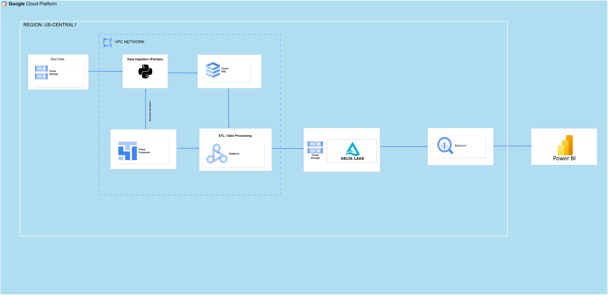

# End-to-End Data Engineering Project with GCP Big Data Technologies

## Introduction

This project demonstrates how we can leverage the Google Cloud Platform to create an ETL (Extract, Transform, Load) pipeline using big data technologies. I'am using a dataset from Brazilian e-commerce, available on Kaggle, to illustrate this process. The dataset contains various categories, including customer data, geolocation details, order information, payment records, seller profiles, and product listings. Through data processing and modeling, we aim to reveal insights like sales trends, top-performing states and cities, popular product categories, leading sellers, average order values, and the typical delivery times, among other valuable information.

## Dataset

This project relies on the Brazilian E-commerce dataset, which contains a wealth of information about online shopping in Brazil. You can access the dataset through this link:

Dataset - https://github.com/balasai24/Uber-Data-Engineering/blob/main/uber_data%20(1).csv

For a deeper understanding of the dataset's structure and field descriptions, refer to the following resources:

1. Website - https://www.kaggle.com/datasets/olistbr/brazilian-ecommerce/data

## Architecture 

## Technology Used
- Programming Language - Python
- Programming Language - SQL
- programming Language - PySpark
- Power BI

Google Cloud Platform
1. Google Cloud Storage
2. Google Cloud MYSQL
3. Google Cloud Composer
4. Google Cloud Dataproc
5. Google Cloud Bigquery
6. Google Cloud VPC Network

## Project Steps
This project follows a step-by-step process to build the Uber ETL pipeline:

## Step 1: Data Acquisition
To start, acquire brazilian ecommerce dataset from kaggle. You can download the dataset using the provided link or visit kaggle website. This step ensures you have the necessary data to proceed with the pipeline.

## Step 2: Data Modeling
In this step, you will learn about data modeling concepts such as fact and dimension tables. Fact tables contain core numerical data, while dimension tables provide descriptive attributes to provide context for the fact data. Understanding these concepts is crucial for designing an effective data model that enables efficient analysis and reporting.

## Step 3: Set Up MySQL Database on GCP

I've used a Python REST API script to create a MySQL instance on Google Cloud Platform (GCP). This involved setting up a service account with the required permissions and saving a JSON key on your local machine for script usage. Also, utilized googleapiclient and google-auth libraries.

To manage the database and tables, I'm utilizing the pymysql library. It's essential to add your local machine's public IP address to GCP's MySQL instance network configuration.

**Note:** Ensure you've enabled the SQL Admin API and Compute Engine API before proceeding.

## Step 4: Ingest Data into MySQL

After setting up the database and tables, the next step involved ingesting data from an Excel file stored in Google Cloud Storage (GCS). To accomplish this, I've employed various libraries, including pandas, pymysql, openpyxl, googleapiclient, google-auth, and google-cloud-storage.

It's essential to ensure that the service account has the requisite privileges to read files from GCS and write data to MySQL tables.

## Step 5: Set Up GCP Composer (Airflow)

To automate all my ETL scripts, I'm utilizing GCP Composer, which is an Airflow service available on Google Cloud Platform.

For provisioning the Composer environment, I've employed a Python REST API script and utilized the googleapiclient and google-auth libraries. I've also referred to the following link to specify various configuration parameters for Composer provisioning:

[Composer Configuration Documentation](https://cloud.google.com/composer/docs/how-to/managing/creating#api_7)

**Note:** Before proceeding, make sure you've enabled the Cloud Composer API and created a service account with the necessary privileges to provision a new Composer environment.

## Step 6: Simulate New Data for Customers and Orders Tables

To enhance the realism of this ETL project, I've implemented two Directed Acyclic Graphs (DAGs) in GCP Composer. These DAGs are scheduled to run daily and are responsible for inserting new records into the customer, order, order_items and order_payments tables.

To achieve this, I'm making use of the 'faker' library to simulate new data and 'pandas' for applying data processing logic.

This step adds a dynamic element to the project.

**Note:** Make sure to create a connection in composer for MySQL database, which is being used in the DAG to connect to MySQL.

## Step 7: ETL and Data Processing with Dataproc Serverless Feature

In this step, I've developed PySpark scripts for each table to conduct ETL processes and store the resulting data as delta tables in Google Cloud Storage.

To automate the execution of these scripts, I've created a Directed Acyclic Graph (DAG) for each table. These DAGs are responsible for orchestrating serverless PySpark batch jobs, each corresponding to a specific PySpark script.

Additionally, I've created a PySpark script to handle incremental data loading for the 'customers' and 'orders' tables, which is scheduled using Composer.

For setting up these processes, I've referred to the following links to specify the parameters in my DAG for creating batch jobs with the necessary configurations and required files:

- [Environment Configuration Reference](https://cloud.google.com/dataproc-serverless/docs/reference/rest/v1/EnvironmentConfig)
- [Runtime Configuration Reference](https://cloud.google.com/dataproc-serverless/docs/reference/rest/v1/RuntimeConfig)

This step significantly enhances the project's data processing capabilities, ensuring efficient ETL and data storage in Google Cloud Storage, including handling incremental data updates.

## Step 8: Create BigQuery External Tables on Delta Tables

After creating Delta tables for all data sources, the next step involves establishing BigQuery external tables that are layered on top of these Delta tables. This enables us to conduct interactive queries and perform data analysis effectively. Importantly, these external tables are automatically updated as new data is inserted into the Delta tables, ensuring real-time access to the most current data.

This integration between Delta tables and BigQuery provides a seamless experience for data analysis and exploration.

Below is the link which I referred to create Bigquery external table on top of delta tables.

- [Creating Bigquery External Table on Delta Table](https://medium.com/google-cloud/delta-tables-with-dataproc-jupyter-and-bigquery-ea2509ca9e0f)

## Step 9: Power BI Dashboard Visualization

The project culminates with the creation of an interactive dashboard using Power BI Desktop, a robust data visualization and business intelligence platform. This dashboard is designed with various visual elements, including cards, pie charts, and bar charts, offering an intuitive interface for data analysis.

The dashboard is a valuable tool for extracting insights from the project's data. To enhance its capabilities, I've utilized DAX (Data Analysis Expressions) to create calculated columns and measures, enabling in-depth data analysis and visualization.

This step adds the crucial layer of data visualization to the project, making it more accessible and insightful for users.

link to Dashboard -https://lookerstudio.google.com/reporting/94b3731d-56a9-4356-8163-fbc2d6eef6ee

## Project Challenges

Throughout the project, I encountered several challenges, with two key hurdles being:

**1. Cloud Composer and Google Cloud SQL Communication:** A major challenge was establishing communication between Cloud Composer and Google Cloud SQL. Despite attempting to implement Cloud SQL proxy, as per a below reference link, I faced difficulties in achieving a seamless connection.

- [Google Cloud SQL Proxy Docs](https://cloud.google.com/sql/docs/mysql/connect-kubernetes-engine)
- [Medium Article](https://medium.com/nerd-for-tech/connecting-gcp-composer-to-cloud-sql-via-proxy-305743a388a)

**Solution:** To resolve this, I adopted a different approach. I created a VPC network with defined subnets and ensured all resources used this VPC network with private IP addresses. This configuration guaranteed that all resources had IP addresses within the specified subnet range, enabling successful inter-resource communication.

**2. Automating Dataproc Serverless Batch Jobs:** Another significant challenge was automating the execution of serverless batch jobs in Dataproc. Specifically, I struggled to figure out how to specify the service account, VPC network, and Spark packages parameters within the "DataprocCreateBatchOperator."

**Solution:** Ultimately, I landed to the below  Google Cloud links that helped me implement the desired configurations and automate the execution of serverless batch jobs.

- [Environment Configuration Reference](https://cloud.google.com/dataproc-serverless/docs/reference/rest/v1/EnvironmentConfig)
- [Runtime Configuration Reference](https://cloud.google.com/dataproc-serverless/docs/reference/rest/v1/RuntimeConfig)

Navigating these challenges strengthened my project's execution and expanded my understanding of Google Cloud services.

